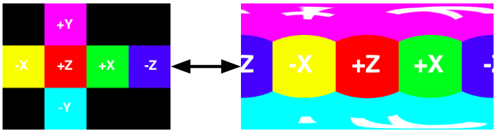

# py360convert

**This README is still under construction**

Features of this project:
- Convertion between cubemap and equirectangular  
    
- Equirectangular to planar  
    
- Pure python implementation and depend only on [numpy](http://www.numpy.org/) and [scipy](https://www.scipy.org/)
- Vectorization implementation (in most of the place)
    - `c2e` takes 300ms and `e2c` takes 160ms on 1.6 GHz Intel Core i5 CPU

## Requirements
- numpy
- scipy
- pillow (for example code to load/save image)

## Run with command line
You can run command line to use the functionality. Please See `python convert360.py -h` for detailed. The python script is also an example code to see how to use this as a package in your code.

## Doc
All of the below examples assume the packages are loaded as:
```
import numpy as np
from PIL import Image
import py360convert
```

#### `c2e(cubemap, h, w, cube_format='dice')`
Convert the given cubemap to equirectangular.  
**Parameters**:
- `cubemap`: Numpy array or list/dict of numpy array (depend on `cube_format`).
- `h`: Output equirectangular height.
- `w`: Output equirectangular width.
- `cube_format`: 'dice' (default) or 'horizon' or 'dict' or 'list'. Telling the format of the given `cubemap`.

**Example**:
```
cube_dice = np.array(Image.open('assert/demo_cube.png'))

# You can make convertion between supported cubemap format
cube_h = py360convert.cube_dice2h(cube_dice)  # the inverse is cube_h2dice
cube_dict = py360convert.cube_h2dict(cube_h)  # the inverse is cube_dict2h
cube_list = py360convert.cube_h2list(cube_h)  # the inverse is cube_list2h
print('cube_dice.shape:', cube_dice.shape)
print('cube_h.shape:', cube_h.shape)
print('cube_dict.keys():', cube_dict.keys())
print('cube_dict["F"].shape:', cube_dict["F"].shape)
print('len(cube_list):', len(cube_list))
print('cube_list[0].shape:', cube_list[0].shape)
```
Output:
```
cube_dice.shape: (768, 1024, 3)
cube_h.shape: (256, 1536, 3)
cube_dict.keys(): dict_keys(['F', 'R', 'B', 'L', 'U', 'D'])
cube_dict["F"].shape: (256, 256, 3)
len(cube_list): 6
cube_list[0].shape: (256, 256, 3)
```
