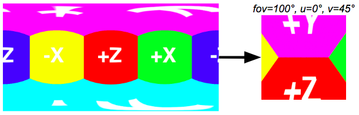
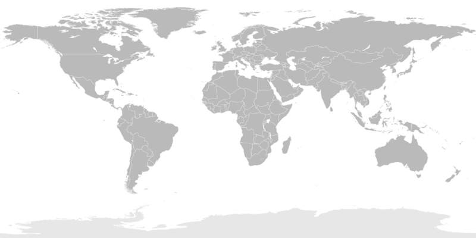
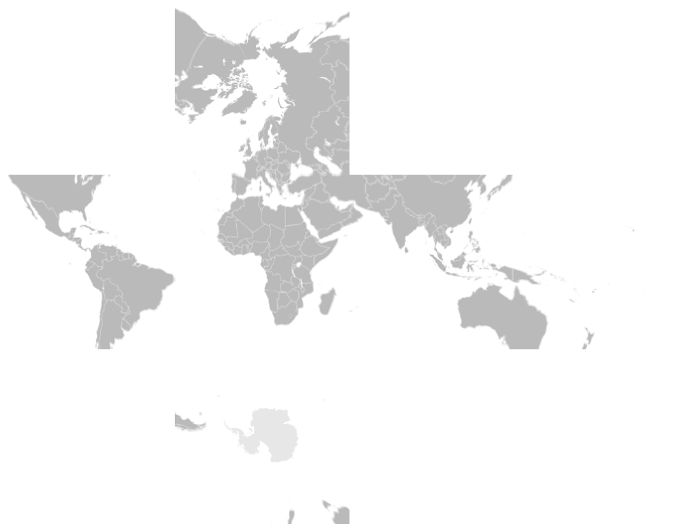
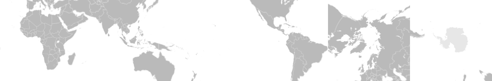

# py360convert

Features of this project:
- Conversion between cubemap and equirectangular  
    
- Equirectangular to planar  
    
- Pure python implementation and depend only on [numpy](http://www.numpy.org/) and [scipy](https://www.scipy.org/)
- Vectorization implementation (in most of the place)
    - `c2e` takes 300ms and `e2c` takes 160ms on 1.6 GHz Intel Core i5 CPU

## Install
```
pip install py360convert
```
Now at everywhere, you can `import py360convert` or use the command line tool `convert360`.

### Command line examples
You can run command line tool to use the functionality. Please See `convert360 -h` for detailed. The python script is also an example code to see how to use this as a package in your code.

```
convert360 e2c assets/example_input.png out.png --size 200
```
| Input Equirectangular | Output Cubemap |
| :---: | :----: |
|  |  |

-----

```
convert360 c2e assets/example_e2c.png out.png --width 800 --height 400
```
| Input Cubemap | Output Equirectangular |
| :---: | :----: |
|  |  |

You can see the blurring artifacts in the polar region because the equirectangular in above figure are resampled twice (`e2c` then `c2e`).

----

```
convert360 e2p assets/example_input.png out.png --width 300 --height 300 --yaw 120 --pitch 23
```
| Input Equirectangular | Output Perspective |
| :---: | :----: |
|  |  |


## Doc

#### `c2e(cubemap, h, w, cube_format='dice')`
Convert the given cubemap to equirectangular.  
**Parameters**:
- `cubemap`: Numpy array or list/dict of numpy array (depend on `cube_format`).
- `h`: Output equirectangular height.
- `w`: Output equirectangular width.
- `mode:str`: Interpolation method; typically `bilinear` or `nearest`. Valid options: "nearest", "linear", "bilinear", "biquadratic", "quadratic", "quad", "bicubic", "cubic", "biquartic", "quartic", "biquintic", "quintic".

- `cube_format`: Options: `'dice'` (default), `'horizon'` or `'dict'` or `'list'`. Indicates the format of the given `cubemap`.
    - Say that each face of the cube is in shape of `256 (width) x 256 (height)`
    - `'dice'`: a numpy array in shape of `1024 x 768` like below example

      
    - `'horizon'`: a numpy array in shape of `1536 x 256` like below example

      
    - `'list'`: a `list` with 6 elements each of which is a numpy array in shape of `256 x 256`. It's just converted from 'horizon' format with one line of code: `np.split(cube_h, 6, axis=1)`.
    - `'dict'`: a `dict` with 6 elements with keys `'F', 'R', 'B', 'L', 'U', 'D'` each of which is a numpy array in shape of `256 x 256`.
    - Please refer to [the source code](https://github.com/sunset1995/py360convert/blob/master/py360convert/utils.py#L176) if you still have question about the conversion between formats.

#### `e2c(e_img, face_w=256, mode='bilinear', cube_format='dice')`
Convert the given equirectangular to cubemap.  
**Parameters**:
- `e_img: NDArray`: Numpy array with shape [H, W, C].
- `face_w: int`: The width of each cube face.
- `mode:str`: See `c2e`.
- `cube_format:str`: See `c2e`.

#### `e2p(e_img, fov_deg, u_deg, v_deg, out_hw, in_rot_deg=0, mode='bilinear')`
Take perspective image from given equirectangular.
**Parameters**:
- `e_img`: Numpy array with shape [H, W, C].
- `fov_deg`: Field of view given in int or tuple `(h_fov_deg, v_fov_deg)`.
- `u_deg`: Horizontal viewing angle in range [-pi, pi]. (- Left / + Right).
- `v_deg`: Vertical viewing angle in range [-pi/2, pi/2]. (- Down/ + Up).
- `out_hw`: Output image `(height, width)` in tuple.
- `in_rot_deg`: Inplane rotation.
- `mode`: `bilinear` or `nearest`.


**Example**:
```python
import numpy as np
from PIL import Image
import py360convert

cube_dice = np.array(Image.open('assets/demo_cube.png'))

# You can make conversion between supported cubemap format
cube_h = py360convert.cube_dice2h(cube_dice)  # the inverse is cube_h2dice
cube_dict = py360convert.cube_h2dict(cube_h)  # the inverse is cube_dict2h
cube_list = py360convert.cube_h2list(cube_h)  # the inverse is cube_list2h
print('cube_dice.shape:', cube_dice.shape)
print('cube_h.shape:', cube_h.shape)
print('cube_dict.keys():', cube_dict.keys())
print('cube_dict["F"].shape:', cube_dict["F"].shape)
print('len(cube_list):', len(cube_list))
print('cube_list[0].shape:', cube_list[0].shape)
```
Output:
```
cube_dice.shape: (768, 1024, 3)
cube_h.shape: (256, 1536, 3)
cube_dict.keys(): dict_keys(['F', 'R', 'B', 'L', 'U', 'D'])
cube_dict["F"].shape: (256, 256, 3)
len(cube_list): 6
cube_list[0].shape: (256, 256, 3)
```
